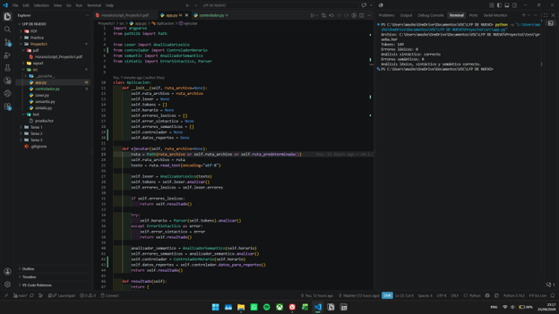
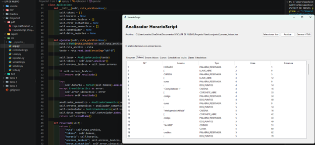
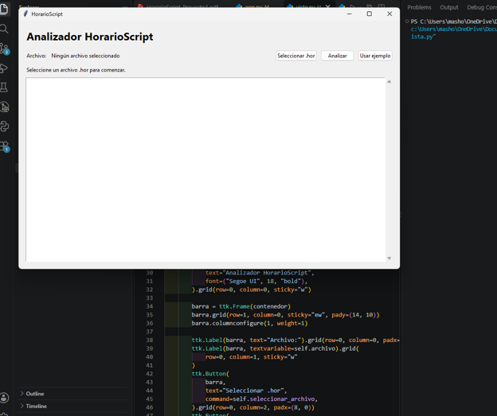

# Manual Tecnico

## 1. Arquitectura

```text
app.py
  -> vista.py
  -> Lexer.py
  -> sintatic.py
  -> semantic.py
  -> controlador.py
  -> reportes.py
```

`app.py` es el punto de entrada y coordina el flujo. La vista Tkinter consume los resultados producidos por `Aplicacion`.

## Evidencia de ejecucion

La ejecucion en consola muestra el resultado de las tres fases del analizador.



## 2. Analizador lexico

El archivo `Lexer.py` contiene:

- `Token`: representa un token con numero, lexema, tipo, linea y columna.
- `ErrorLexico`: representa un error estructurado.
- `AnalizadorLexico`: implementa el AFD manual.

El metodo `siguiente_token()` observa el caracter actual, consume el lexema y devuelve un token. No se utiliza `re`, `split()` ni `find()` para la tokenizacion principal.

Tipos reconocidos:

- `PALABRA_RESERVADA`
- `CODIGO`
- `CADENA`
- `HORA`
- `ENTERO`
- `DIA`
- `CATEGORIA`
- delimitadores estructurales
- `EOF`

Los comentarios que comienzan con `##` se ignoran hasta el salto de linea o el final del archivo.

La tabla de tokens se presenta en la interfaz con la informacion de posicion
producida por `Token`.



## 3. Analizador sintactico

`sintatic.py` contiene un parser descendente. Verifica la estructura:

```text
HORARIO {
    CURSOS { ... };
    CATEDRATICOS { ... };
    AULAS { ... };
    CLASES { ... };
};
```

El parser consume los tokens con `esperar()`. Si el token actual no coincide con el esperado, genera `ErrorSintactico` con linea y columna.

## 4. Analizador semantico

`semantic.py` construye tablas de simbolos para cursos, catedraticos y aulas. Luego verifica:

- declaraciones duplicadas;
- referencias a elementos no declarados;
- creditos y capacidades positivas;
- dias y categorias validas;
- hora inicial anterior a hora final;
- choques de catedratico;
- choques de aula.

## 5. Controlador

`controlador.py` convierte el horario en datos preparados para la vista y los reportes. Agrupa clases por dia, aula y catedratico, y calcula estadisticas generales.

La interfaz completa que consume estos datos se muestra a continuacion:



## 6. Ejecucion

```powershell
python .\Proyecto1\src\app.py
python .\Proyecto1\src\app.py --consola
```

## 7. Limitaciones conocidas

La recuperacion sintactica continua despues del primer error aun puede ampliarse. Las funcionalidades opcionales como exportacion CSV/JSON, resaltado en tiempo real y multiples archivos no forman parte de la version actual.
